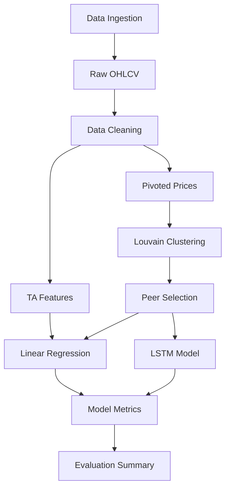
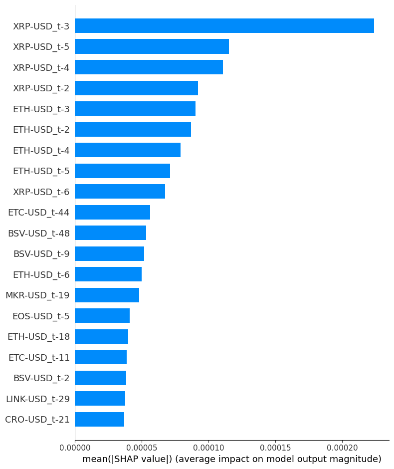

# 🧠 Crypto Price Prediction & Network Analysis

This project applies technical analysis, machine learning, and network science to model and forecast Bitcoin price behavior using signals from its correlated crypto ecosystem and macroeconomic context.

---

## 🚀 Project Highlights

- ✅ BTC price prediction **Linear Regression** and **LSTM**
- 📊 Technical indicators computed using the `ta` library (MACD, RSI, MFI, EMA, etc.)
- 🌐 Integration with **Snowflake** for crypto data staging, historical persistence, and time series upserts
- 🧹 Cluster discovery using:
  - K-Means (based on return patterns)
  - Agglomerative (correlation distance)
  - **Louvain** (graph community detection on correlation networks)
- 🌐 Network graph visualization of crypto relationships and influence
- 🧮 Use of **macroeconomic indicators**, including:
  - Gold (GC=F), Silver (SI=F), S&P 500 (^GSPC), Nasdaq (^NDX), VIX
  - On-chain metrics: hash rate, miner revenue, active addresses, days destroyed
- 🔬 Feature selection using **p-values** from regression analysis
- 📈 Model evaluation via:
  - R² Score
  - RMSE
  - Actual vs Predicted line charts
  - Residual analysis

---

## 🔧 Features

- Fetches and stores data in **Snowflake**
- Uses cluster-based filtering for predictive features
- Combines traditional market, blockchain metrics, and crypto-specific TA

### 🏩 Macroeconomic + On-chain Data

- Traditional assets:
  - S&P 500 (^GSPC), Nasdaq (^NDX), Gold (GC=F), Silver (SI=F), VIX
- On-chain metrics from [blockchain.com API]:
  - Hash rate, miner revenue, Bitcoin days destroyed, difficulty, active addresses
- BTC-to-local-currency tickers:
  - BTC-INR, BTC-GBP, BTC-RUB, etc.

---

## 🛠️ Setup

Install dependencies:

```bash
pip install -r requirements.txt
```

---

## 📁 Folder Structure

```
.
├── crypto.ipynb         # Main notebook with full pipeline
├── utilities.py         # Utility functions for TA, clustering, Snowflake, etc.
├── Assets_Categorized.csv # Categorized asset metadata
├── README.md            # Project overview
├── requirements.txt     # Python dependencies
└── assets/              # Exported charts and plots
```

---

## 🔄 Dataflow Overview

The following diagram shows the overall pipeline from data ingestion to model evaluation:




---

## 🧠 Model Insights

### ✅ Linear Regression (with reduced features)

- R² Score: **0.9756**
- RMSE: **\$2412**

### ✅ LSTM (price delta prediction)

- R² Score: **0.9826**
- RMSE: **\$2097**

### 💡 Observations

- Predicting **price delta** (instead of raw price) significantly improved LSTM's stability and interpretability.
- **LSTM now outperforms linear regression**, especially in volatile windows.
- Models trained with **Louvain-filtered features** show higher signal strength by reducing noise from low-correlation assets.
- All performance metrics are computed with **inverse-transformed prices** to preserve dollar-accuracy.

---

## 📌 Notes

- Ensure your Snowflake user has correct **roles and permissions**
- [FRED API] and `yfinance` are used for macro and market data
- VPNs or regional restrictions may block some endpoints

---

## 🔐 Snowflake Key Pair Authentication Setup

This project uses **key pair authentication** to securely connect to Snowflake.

### 🔧 Step 1: Generate Public/Private Key Pair

#### For Linux/macOS (OpenSSL):

```bash
openssl genrsa -out rsa_key.pem 2048
openssl rsa -in rsa_key.pem -pubout -out rsa_key.pub
```

#### For Windows (using PowerShell + OpenSSL):

1. Install [OpenSSL for Windows](https://slproweb.com/products/Win32OpenSSL.html)
2. Run:

```powershell
openssl genrsa -out rsa_key.pem 2048
openssl rsa -in rsa_key.pem -pubout -out rsa_key.pub
```

> 📝 Or use PuTTYgen (convert to PEM format)

---

### 🔐 Step 2: Upload Public Key to Snowflake

```sql
ALTER USER your_user_name SET RSA_PUBLIC_KEY='your_public_key_contents';
```

> ⚠️ Remove the `-----BEGIN PUBLIC KEY-----` and `END` lines

---

### ⚙️ Step 3: Add `.env` Variables

```ini
PRIVATE_KEY_PATH=/path/to/rsa_key.pem
SNOWFLAKE_ACCOUNT=your_account_id
SNOWFLAKE_USER=your_user_name
SNOWFLAKE_WAREHOUSE=your_warehouse
SNOWFLAKE_DATABASE=CryptoDB
SNOWFLAKE_SCHEMA=PUBLIC
SNOWFLAKE_ROLE=ACCOUNTADMIN
```

---

### ✅ You're Ready!

Your notebook will now securely connect to Snowflake using your key.

📚 [Snowflake Key Pair Auth Docs](https://docs.snowflake.com/en/user-guide/key-pair-auth)

---

## 🧠 Built With

- `pandas`, `scikit-learn`, `statsmodels`, `matplotlib`, `seaborn`
- `ta` & `talib` for technical analysis
- `networkx` & `python-louvain` for crypto correlation graphs
- `yfinance`, CoinGecko API, blockchain.com for data ingestion

---

## 🔬 Advanced Analyses and Enhancements

- 📹 Animate Louvain clusters over time using rolling windows
- 🧠 Score and monitor BTC’s influence using graph centrality metrics (eigenvector, betweenness)
- 🤖 Explore hybrid deep learning models (e.g., LSTM + Attention) and multi-step forecasting
- 📉 Evaluate multicollinearity using Variance Inflation Factor (VIF)
- 🧩 Model explainability with SHapley Additive exPlanations (SHAP)
  - 🧮 Applied SHAP to linear regression model to interpret feature importance. Bollinger Bands and EMAs were found to be the most influential predictors of BTC price.
- 📊 Benchmark performance against naive models (e.g., previous value, moving average)
- 📈 Visualize true vs predicted prices, residual trends, and percentage-based errors
- 🌐 Expose the best-performing model as a REST API or Power BI dashboard
- 📎 Expand SHAP explainability to include traditional assets (e.g., AAPL, MSFT, GLD) that may indirectly influence BTC, even if excluded from Louvain clusters.
- 🧠 Implement top-N token filtering or feature pruning to enable SHAP analysis without hitting GPU memory constraints.
- ☁️ Test high-dimensional SHAP explanations using Google Colab Pro (A100 GPU) or local distributed inference environments.


---

### 🔍 SHAP Summary: LSTM Feature Importance

The LSTM model primarily relies on historical price movements of peer cryptocurrencies such as `ETC`, `BCH`, `XTZ`, and `ALGO` to predict BTC price deltas. Feature contributions span multiple time steps, confirming the temporal depth learned by the model.
This LSTM+SHAP analysis reveals that recent price movements of major altcoins like Ethereum (ETH), Binance Coin (BNB), and Stellar (XLM) exert strong short-term influence on Bitcoin price predictions. The model consistently assigns high importance to these assets' prices in the past 1–5 days, validating inter-token predictive relationships in the crypto ecosystem.



---
## 📉 Why Time Series Modeling Was Intentionally Excluded

While traditional time series models (e.g., ARIMA, Prophet) are commonly used in financial forecasting, I opted not to integrate them directly into this crypto prediction pipeline. Instead, the model leverages technical indicators, market network clustering (e.g., Louvain method), and regression techniques that already encapsulate key temporal dynamics, such as trend and volatility.

Time series models often assume a degree of stationarity or autocorrelation that is weak or unstable in high-volatility assets like cryptocurrencies. Given the already robust performance of the current feature set and the noisy nature of crypto markets, time series forecasting was evaluated but not adopted as it would likely contribute marginal additional signal. However, it remains a complementary option for long-term portfolio modeling or for generating probabilistic return bands in future iterations.

Made with ❤️ and insomnia.

### 🚧 Known Limitation

Due to the memory complexity of SHAP with full LSTM input (60 timesteps × 140+ tokens), 
explanations are currently computed only within the Louvain-filtered cluster around BTC. 
This improves model interpretability and reduces dimensionality for SHAP.


