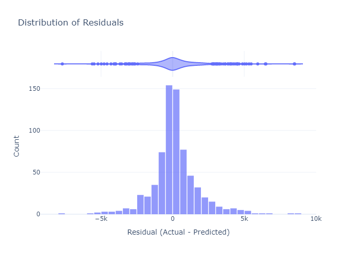

# 📈 Bitcoin Price Prediction with Financial Indicators

This project uses multiple financial indicators, macroeconomic data (NASDAQ, S&P 500, VIX), and technical features (e.g., Bollinger Bands) to build and evaluate a machine learning model predicting the next-day price of Bitcoin.

## 🚀 Features
- Fetches and stores data in **Snowflake**
- Incorporates:
  - Bitcoin OHLCV data
  - Fear and Greed Index
  - NASDAQ, S&P 500, VIX
  - Bollinger Bands, Returns, Volatility
- Performs data cleaning and joins using SQL
- Linear Regression modeling with p-value feature selection
- Rich visualizations:
  - Actual vs. Predicted
  - MAE/RMSE % over time
  - Residuals, Error distribution
  - Feature correlation & significance

## 🛠️ Setup

Install dependencies:

```bash
pip install -r requirements.txt
```

## 📁 Folder Structure

```
.
├── Bitcoin.ipynb        # Main notebook with full pipeline
├── README.md            # Project overview
├── requirements.txt     # Python dependencies
└── assets/              # Exported charts and plots
```

## 🧠 Model Insights
- R² ≈ 0.995
- Average MAE ≈ $1,000
- Most impactful features: `Close`, `NASDAQ`, `Bollinger Bands`
- S&P 500 and VIX had low significance for short-term BTC prediction.

## 📊 Visual Output Samples




## 📌 Notes
- Ensure your Snowflake account has the correct roles & table permissions.
- FRED API used for macro indicators (S&P 500, VIX).
- VPNs may block `yfinance` and some endpoints.

---

Made with ❤️ and insomnia.


## 🔐 Snowflake Key Pair Authentication Setup

This project uses **key pair authentication** to securely connect to Snowflake.

### 🔧 Step 1: Generate Public/Private Key Pair

#### For Linux/macOS (OpenSSL):
```bash
openssl genrsa -out rsa_key.pem 2048
openssl rsa -in rsa_key.pem -pubout -out rsa_key.pub
```

#### For Windows (using PowerShell + OpenSSL):
1. Install [OpenSSL for Windows](https://slproweb.com/products/Win32OpenSSL.html)
2. Open PowerShell and run:
```powershell
openssl genrsa -out rsa_key.pem 2048
openssl rsa -in rsa_key.pem -pubout -out rsa_key.pub
```

> 📝 You can also use **PuTTYgen**, but you'll need to convert the key to PEM format.

---

### 🔐 Step 2: Upload the Public Key to Your Snowflake User

1. Open your Snowflake WebUI or SQL editor and run:

```sql
ALTER USER your_user_name SET RSA_PUBLIC_KEY='your_public_key_contents';
```

> ❗ Remove the `-----BEGIN PUBLIC KEY-----` and `-----END PUBLIC KEY-----` lines when pasting into Snowflake.

---

### ⚙️ Step 3: Add the `.env` Variables

Create a `.env` file and include:

```ini
PRIVATE_KEY_PATH=/path/to/rsa_key.pem
SNOWFLAKE_ACCOUNT=your_account_id
SNOWFLAKE_USER=your_user_name
SNOWFLAKE_WAREHOUSE=your_warehouse
SNOWFLAKE_DATABASE=CryptoDB
SNOWFLAKE_SCHEMA=PUBLIC
SNOWFLAKE_ROLE=ACCOUNTADMIN  # or another granted role
```

---

### ✅ You're ready!

The notebook will automatically use your private key to connect securely to Snowflake.

📚 Official Docs: [Snowflake Key Pair Auth Guide](https://docs.snowflake.com/en/user-guide/key-pair-auth)
